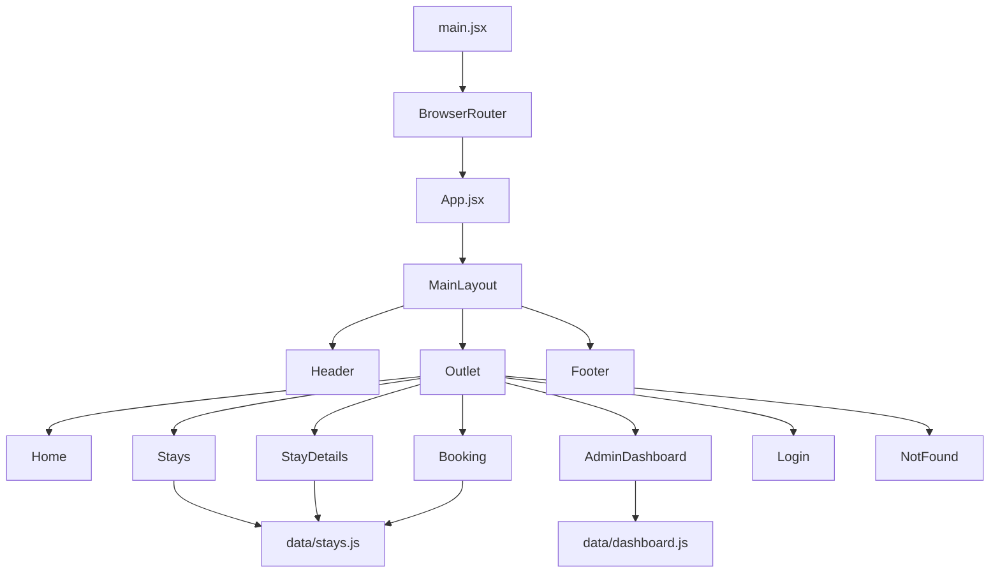
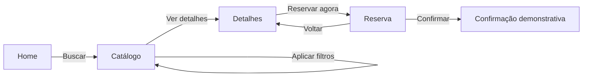

# Documentação do Projeto — Aurora Stay Iceland

## 1. Visão geral

O **Aurora Stay Iceland** é um protótipo acadêmico de uma plataforma de descoberta e simulação de reservas de hospedagens na Islândia. A experiência foi construída como uma SPA responsiva, com navegação fluida entre página inicial, catálogo, detalhes da hospedagem, reserva demonstrativa e painel administrativo.

O projeto atual é exclusivamente frontend e utiliza dados locais. Não há backend, banco de dados, autenticação real nem processamento de pagamentos.

### Produção

- Aplicação: https://aurora-stay-iceland.vercel.app/
- Repositório: https://github.com/Riclacper/aurora-stay-iceland
- Portfólio do autor: https://portfolio-ricardo-lacerda.vercel.app/#projetos

---

## 2. Objetivos do projeto

O protótipo demonstra:

- desenvolvimento frontend moderno com React;
- arquitetura SPA;
- componentização;
- navegação com parâmetros de URL;
- filtros e paginação;
- cálculo de reserva;
- dashboard analítico visual;
- responsividade;
- acessibilidade básica;
- deploy contínuo na Vercel;
- apresentação profissional para portfólio.

---

## 3. Escopo atual

### Incluído

- página inicial responsiva;
- busca por destino, datas e quantidade de hóspedes;
- catálogo com 60 hospedagens demonstrativas;
- filtros por texto, região, capacidade e perfil da viagem;
- ordenação por preço, avaliação e capacidade;
- paginação com 8 cards por página;
- página de detalhes da hospedagem;
- fluxo de reserva demonstrativa;
- validação de formulário;
- cálculo de noites, subtotal, taxas e total;
- confirmação com código demonstrativo;
- dashboard administrativo analítico;
- gráficos interativos para mouse, toque e teclado;
- fallback automático para imagens indisponíveis;
- footer com créditos e links profissionais;
- rota 404.

### Fora do escopo atual

- cadastro real de usuários;
- autenticação e autorização;
- persistência em banco de dados;
- API backend;
- pagamento online;
- disponibilidade real de hospedagens;
- envio de e-mail;
- geração real de relatórios;
- sincronização com plataformas externas.

---

## 4. Stack tecnológica

### Frontend

- React 19;
- React DOM 19;
- Vite 7;
- React Router DOM 7;
- Framer Motion;
- Lucide React;
- CSS modularizado por responsabilidade.

### Infraestrutura

- GitHub para versionamento;
- Vercel para deploy;
- configuração SPA por `vercel.json`.

### Scripts disponíveis

| Comando | Finalidade |
|---|---|
| `npm run dev` | inicia o ambiente local de desenvolvimento |
| `npm run build` | gera o build de produção |
| `npm run preview` | executa localmente o build gerado |

O projeto ainda não possui comandos separados para lint, testes unitários ou testes de integração.

---

## 5. Arquitetura geral



### Responsabilidades principais

- `main.jsx`: inicialização da aplicação e carregamento dos estilos globais;
- `App.jsx`: definição das rotas;
- `MainLayout.jsx`: composição comum com Header, conteúdo e Footer;
- `components/`: componentes reutilizáveis;
- `pages/`: páginas da aplicação;
- `data/`: dados demonstrativos;
- `styles/`: estilos globais, melhorias e dashboard;
- `utils/`: funções auxiliares reutilizáveis.

---

## 6. Estrutura de diretórios

```text
.
├── docs/
│   └── DOCUMENTACAO_DO_PROJETO.md
├── public/
├── src/
│   ├── components/
│   │   ├── Footer.jsx
│   │   ├── Header.jsx
│   │   ├── SearchBox.jsx
│   │   ├── SectionTitle.jsx
│   │   └── StayCard.jsx
│   ├── data/
│   │   ├── dashboard.js
│   │   └── stays.js
│   ├── layouts/
│   │   └── MainLayout.jsx
│   ├── pages/
│   │   ├── AdminDashboard.jsx
│   │   ├── Booking.jsx
│   │   ├── Home.jsx
│   │   ├── Login.jsx
│   │   ├── NotFound.jsx
│   │   ├── StayDetails.jsx
│   │   └── Stays.jsx
│   ├── styles/
│   │   ├── dashboard-interactions.css
│   │   ├── dashboard.css
│   │   ├── enhancements.css
│   │   └── global.css
│   ├── utils/
│   │   └── imageFallback.js
│   ├── App.jsx
│   └── main.jsx
├── package.json
├── vercel.json
└── README.md
```

---

## 7. Rotas

| Rota | Componente | Descrição |
|---|---|---|
| `/` | `Home` | página inicial e busca principal |
| `/hospedagens` | `Stays` | catálogo, filtros, ordenação e paginação |
| `/hospedagens/:id` | `StayDetails` | detalhes de uma hospedagem |
| `/reserva/:id` | `Booking` | simulação de reserva |
| `/admin` | `AdminDashboard` | dashboard administrativo demonstrativo |
| `/login` | `Login` | tela visual de acesso administrativo |
| `*` | `NotFound` | página não encontrada |

Todas as rotas são renderizadas dentro de `MainLayout`, preservando Header e Footer.

---

## 8. Fluxo de navegação



A pesquisa inicial envia parâmetros pela URL. Esses parâmetros são preservados durante a navegação até a reserva.

### Parâmetros usados

| Parâmetro | Exemplo | Origem |
|---|---|---|
| `destino` | `Vík` | busca e catálogo |
| `checkin` | `2026-07-10` | busca e reserva |
| `checkout` | `2026-07-15` | busca e reserva |
| `hospedes` | `4` | busca, catálogo e reserva |
| `regiao` | `Costa Sul` | catálogo |
| `categoria` | `aurora` | catálogo |
| `ordem` | `menor-preco` | catálogo |
| `pagina` | `3` | catálogo |

---

## 9. Página inicial

A Home apresenta:

- hero com proposta de valor;
- busca principal;
- datas futuras calculadas dinamicamente;
- seleção de hóspedes;
- indicadores baseados no catálogo local;
- seis hospedagens em destaque;
- chamada para o catálogo completo;
- animações com Framer Motion.

### Regras de datas

- check-in inicial: data atual + 7 dias;
- check-out inicial: data atual + 14 dias;
- check-out sempre posterior ao check-in;
- datas são enviadas no formato `YYYY-MM-DD`.

---

## 10. Catálogo de hospedagens

O catálogo utiliza 60 registros gerados de forma determinística em `src/data/stays.js`.

A remoção da geração aleatória garante que:

- nomes não mudem após recarregar;
- preços permaneçam estáveis;
- avaliações não sejam recalculadas;
- filtros produzam resultados previsíveis;
- o dashboard e a reserva sejam consistentes.

### Campos de cada hospedagem

```js
{
  id,
  name,
  location,
  price,
  rating,
  guests,
  type,
  image,
  category,
  tags
}
```

### Recursos do catálogo

- pesquisa textual por nome, local, tipo, categoria e tags;
- filtro por região;
- filtro por capacidade mínima;
- filtro por perfil da viagem;
- ordenação por recomendação, menor preço, maior preço, avaliação ou capacidade;
- 8 hospedagens por página;
- sincronização de estado com query string;
- limpeza completa dos filtros;
- contador de resultados;
- mensagem para busca sem resultados.

---

## 11. Imagens e fallback

As imagens principais usam URLs externas do Unsplash.

Como imagens externas podem ser removidas ou ficar indisponíveis, foi criada a função `applyStayImageFallback` em `src/utils/imageFallback.js`.

O fallback é aplicado em:

- cards do catálogo;
- página de detalhes;
- resumo da reserva.

A função remove o manipulador de erro antes de aplicar a imagem substituta, evitando repetição infinita caso o fallback também falhe.

---

## 12. Página de detalhes

A página de detalhes exibe:

- imagem;
- tipo da hospedagem;
- nome;
- localização;
- capacidade;
- avaliação;
- tags;
- preço por noite;
- descrição;
- botão `Reservar agora`.

A navegação para a reserva preserva os parâmetros relevantes da pesquisa.

---

## 13. Reserva demonstrativa

A reserva não realiza cobrança e não envia dados para servidor.

### Campos

- nome completo;
- e-mail;
- telefone;
- documento;
- check-in;
- check-out.

### Validações

- nome obrigatório;
- e-mail obrigatório e com formato válido;
- telefone obrigatório;
- documento obrigatório;
- check-in igual ou posterior à data atual;
- check-out posterior ao check-in.

### Cálculo

```text
subtotal = preço da diária × quantidade de noites
total = subtotal + taxa fixa
```

A taxa fixa demonstrativa é de **US$ 90,00**.

### Confirmação

Após validação, a página gera um código aleatório no padrão:

```text
AST-XXXXXX
```

Depois da confirmação:

- o resumo é exibido;
- os campos são bloqueados;
- o botão muda para `Reserva confirmada`;
- nenhuma informação é persistida.

---

## 14. Dashboard administrativo

O dashboard em `/admin` é exclusivamente demonstrativo.

### Filtros

- últimos 6 meses;
- últimos 12 meses.

### KPIs

- reservas simuladas;
- receita projetada;
- diária média;
- ocupação estimada.

### Visualizações

- evolução das reservas;
- distribuição por status;
- receita por região;
- ranking de hospedagens;
- tabela de reservas recentes;
- resumo do catálogo.

### Interações

#### Gráfico de performance

- hover no desktop;
- clique para fixar o tooltip;
- toque no smartphone;
- teclado com `Enter` ou barra de espaço.

#### Gráfico de status

- hover ou foco no setor;
- toque ou clique para fixar;
- porcentagem e quantidade exibidas;
- legenda interativa;
- suporte por teclado.

### Status utilizados

- confirmada;
- pendente;
- cancelada.

---

## 15. Estilos e responsividade

A estilização foi separada em quatro arquivos:

| Arquivo | Responsabilidade |
|---|---|
| `global.css` | base visual e componentes originais |
| `enhancements.css` | modernização da Home, catálogo, Admin e Footer |
| `dashboard.css` | estrutura e componentes do dashboard |
| `dashboard-interactions.css` | interações dos gráficos e tooltips |

### Breakpoints principais

O layout possui ajustes para:

- desktop amplo;
- notebooks;
- tablets;
- smartphones.

Nos dispositivos menores:

- grids passam para uma coluna;
- controles ocupam a largura disponível;
- gráficos permitem rolagem horizontal quando necessário;
- tabelas usam contêiner com overflow;
- cards e filtros preservam legibilidade.

---

## 16. Acessibilidade

Recursos implementados:

- textos alternativos em imagens;
- associação entre `label` e campos;
- `aria-invalid` em campos com erro;
- mensagens com `role="alert"`;
- confirmação com `aria-live`;
- navegação dos gráficos por teclado;
- `aria-label` em setores, pontos e botões de ícone;
- estados visuais de foco;
- botões reais para elementos interativos.

Melhorias futuras recomendadas:

- auditoria completa com Lighthouse;
- teste com leitor de tela;
- revisão de contraste WCAG;
- link de pular para o conteúdo;
- testes automatizados de acessibilidade.

---

## 17. Instalação local

### Requisitos

- Node.js compatível com Vite 7;
- npm;
- Git.

### Clonar

```bash
git clone https://github.com/Riclacper/aurora-stay-iceland.git
cd aurora-stay-iceland
```

### Instalar dependências

```bash
npm install
```

### Executar em desenvolvimento

```bash
npm run dev
```

### Gerar build

```bash
npm run build
```

### Testar o build localmente

```bash
npm run preview
```

---

## 18. Deploy

### Vercel

O projeto utiliza `vercel.json` para redirecionar todas as rotas para a entrada da SPA:

```json
{
  "rewrites": [
    {
      "source": "/(.*)",
      "destination": "/"
    }
  ]
}
```

Isso permite acessar diretamente rotas como `/admin` ou `/hospedagens/12` sem receber erro 404 do servidor.

### Processo atual

1. alterações são enviadas ao GitHub;
2. a Vercel detecta a atualização;
3. branches geram Preview Deployments;
4. a branch `main` gera o deploy de produção.

---

## 19. Checklist de validação manual

### Home

- [ ] a página carrega sem erros;
- [ ] as datas iniciais são futuras;
- [ ] a troca de check-in ajusta o limite do check-out;
- [ ] a busca abre o catálogo com parâmetros na URL;
- [ ] os seis cards de destaque carregam imagens.

### Catálogo

- [ ] aparecem 8 cards por página;
- [ ] a paginação atualiza a URL;
- [ ] filtros retornam resultados coerentes;
- [ ] a ordenação funciona;
- [ ] limpar filtros restaura o catálogo;
- [ ] imagens indisponíveis usam fallback;
- [ ] detalhes preservam os parâmetros relevantes.

### Reserva

- [ ] datas e hóspedes são carregados da URL;
- [ ] campos obrigatórios exibem mensagens;
- [ ] e-mail inválido é bloqueado;
- [ ] quantidade de noites é calculada corretamente;
- [ ] subtotal, taxa e total são exibidos em dólar;
- [ ] a confirmação gera código `AST-XXXXXX`;
- [ ] campos ficam bloqueados após confirmar.

### Admin

- [ ] filtro de 6 e 12 meses altera os dados;
- [ ] KPIs atualizam;
- [ ] tooltip do gráfico de performance funciona;
- [ ] gráfico de status mostra porcentagem;
- [ ] interações funcionam por toque;
- [ ] tabela permanece utilizável no celular.

### Navegação

- [ ] Header e Footer aparecem em todas as páginas;
- [ ] links internos não recarregam a aplicação;
- [ ] rota inexistente exibe NotFound;
- [ ] acesso direto a uma rota funciona na Vercel.

---

## 20. Manutenção

### Adicionar ou alterar hospedagens

Editar `src/data/stays.js`.

Ao alterar os dados, verificar:

- IDs únicos;
- preço numérico;
- avaliação convertível para número;
- capacidade numérica;
- categoria presente nos filtros;
- URL de imagem válida;
- tags sem duplicação desnecessária.

### Alterar paginação

Editar a constante:

```js
const ITEMS_PER_PAGE = 8;
```

em `src/pages/Stays.jsx`.

### Alterar taxa da reserva

Editar:

```js
const FEES = 90;
```

em `src/pages/Booking.jsx`.

### Alterar períodos do dashboard

Editar `dashboardPeriods` em `src/data/dashboard.js`.

### Adicionar rota

1. criar a página em `src/pages/`;
2. importar em `src/App.jsx`;
3. registrar uma nova `<Route />`;
4. incluir navegação quando necessário;
5. validar acesso direto na Vercel.

---

## 21. Limitações conhecidas

- dados são locais e demonstrativos;
- confirmação é perdida ao recarregar;
- não há histórico persistente;
- login não autentica usuários;
- Admin não executa operações reais;
- imagens dependem de serviços externos;
- não existem testes automatizados;
- não há lint configurado;
- não há tratamento global de erros;
- os dados do dashboard não são derivados das reservas feitas pelo visitante.

---

## 22. Recomendações para evolução

### Prioridade alta

- adicionar ESLint;
- adicionar testes com Vitest e React Testing Library;
- implementar backend Node.js;
- persistir reservas;
- adicionar autenticação;
- validar capacidade máxima na reserva;
- centralizar formatadores de data e moeda.

### Prioridade média

- mover imagens críticas para armazenamento controlado;
- criar filtros de faixa de preço;
- adicionar favoritos;
- adicionar skeleton loading;
- criar paginação acessível com resumo reduzido em telas pequenas;
- implementar exportação de relatório;
- adicionar testes E2E com Playwright.

### Prioridade futura

- pagamentos;
- disponibilidade real;
- integração com mapas;
- avaliações de usuários;
- internacionalização;
- CMS para hospedagens;
- painel administrativo completo.

---

## 23. Segurança e privacidade

O protótipo não deve ser usado para coletar dados reais.

Boas práticas atuais:

- não solicita cartão;
- informa que a reserva é demonstrativa;
- não transmite formulário para servidor;
- não armazena dados pessoais;
- não usa tokens de autenticação.

Antes de uma versão real, será necessário implementar:

- política de privacidade;
- consentimento e base legal para dados pessoais;
- criptografia em trânsito;
- controle de acesso;
- proteção contra abuso;
- validação no servidor;
- logs e auditoria;
- conformidade com a LGPD.

---

## 24. Convenção de contribuição

Fluxo recomendado:

1. criar uma branch a partir da `main`;
2. realizar alterações pequenas e focadas;
3. executar `npm run build`;
4. testar o Preview Deployment;
5. abrir Pull Request;
6. revisar o diff;
7. usar `Squash and merge` quando houver muitos commits intermediários.

Exemplo de branch:

```text
feat/filtro-faixa-preco
fix/imagem-card
chore/documentacao
```

---

## 25. Autor e créditos

**Ricardo Lacerda Pereira**  
ADS035N-5P-2026.1-RLP

- GitHub: https://github.com/Riclacper
- LinkedIn: https://www.linkedin.com/in/ricardo-lacerda-pereira/
- Portfólio: https://portfolio-ricardo-lacerda.vercel.app/#projetos

Projeto acadêmico — Aurora Stay Iceland © 2026
